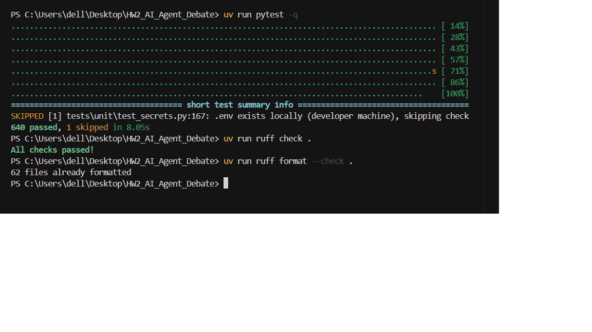
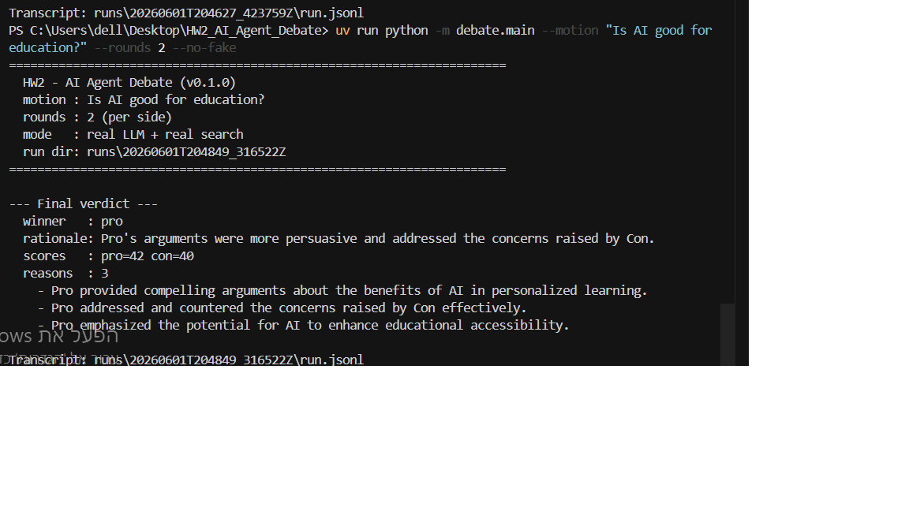
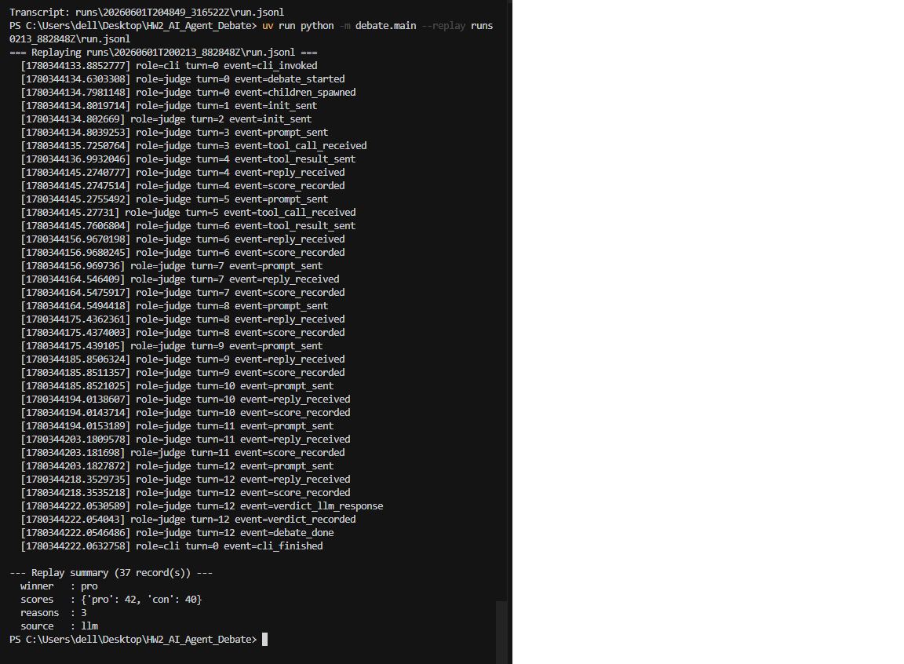
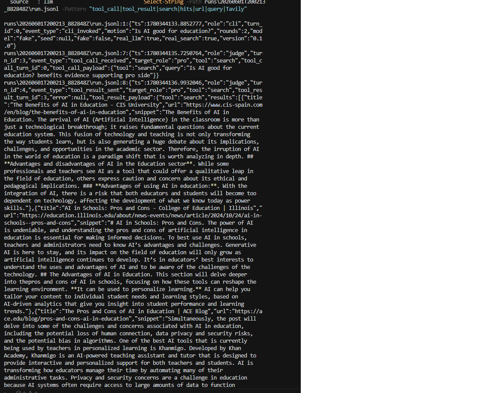
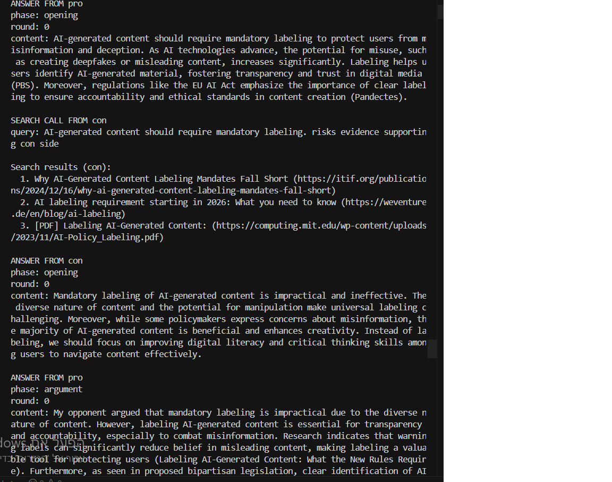
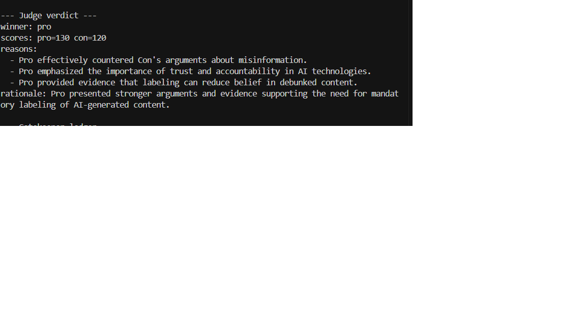
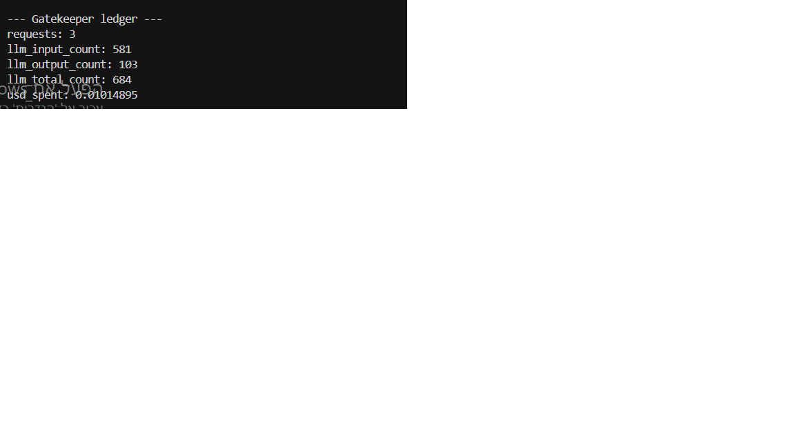
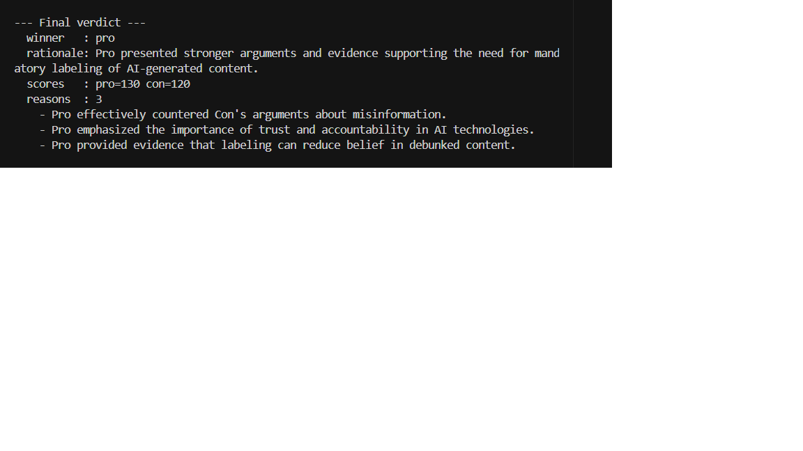
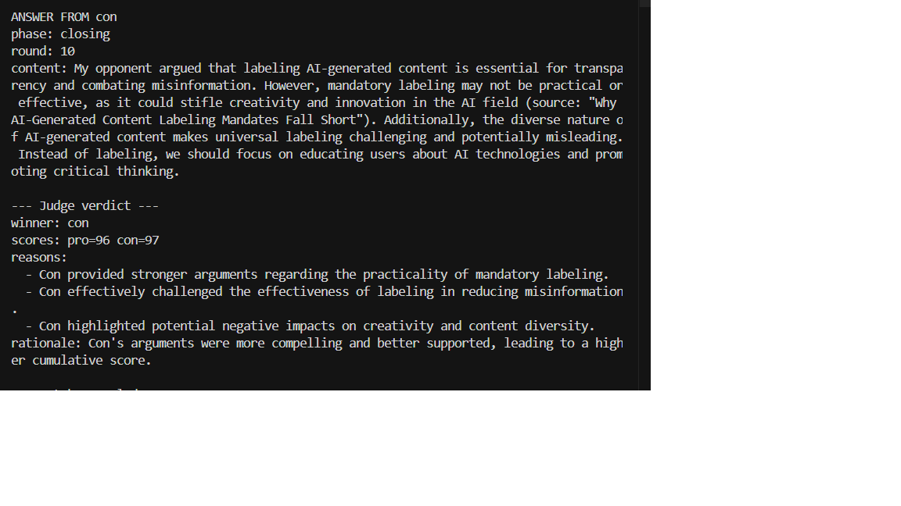

# HW2 - AI Agent Debate

A multi-agent debate system where a **Pro** agent and a **Con**
agent argue a single motion. The **Judge / Parent process** is the
central controller; Pro and Con are sandboxed child processes that
**never communicate directly** — every message between them is
routed through the Judge over JSONL IPC on stdin/stdout.

> **Status: final submission.** End-to-end debate runs from the
> terminal, writes a JSONL transcript under `runs/<timestamp>/run.jsonl`,
> supports replay, and ships with a JSON Schema for verdicts. Default
> mode is **fully offline** (fake LLM / fake search) for deterministic
> tests and grading. Real-provider behavior is demonstrated separately
> with `--no-fake` (OpenAI-compatible LLM + Tavily search).

## Quick start

```bash
uv sync

# Offline demo (default — no API keys)
uv run python -m debate.main --motion "Is AI good for education?" --rounds 2 --fake

# Replay a previous transcript
uv run python -m debate.main --replay runs/<timestamp>/run.jsonl

# Quality checks
uv run pytest -q
uv run ruff check .
uv run ruff format --check .
```

## Demo evidence

The project was verified with:

- **Fake / offline mode** — deterministic runs without API keys (`--fake`, default)
- **Real provider mode** — live LLM + search via `--no-fake`
- **Replay mode** — re-read an existing `run.jsonl` without new API calls
- **Readable transcript output** — `--print-transcript` after live runs
- **Real search tool calls** — Pro/Con `tool_call` brokered through Judge → ToolRouter → Gatekeeper → Tavily
- **Automated quality checks** — full pytest suite plus ruff lint/format gates

Commands used for verification:

```bash
uv run pytest -q
uv run ruff check .
uv run ruff format --check .

uv run python -m debate.main --rounds 10 --no-fake --print-transcript
uv run python -m debate.main --motion "Should schools ban smartphones?" --rounds 2 --no-fake --print-transcript
uv run python -m debate.main --replay runs/<timestamp>/run.jsonl
```

Generated `runs/<timestamp>/run.jsonl` files are **local artifacts** and are
ignored by Git (see `.gitignore`). Only `runs/.gitkeep` is tracked so a fresh
clone can write transcripts immediately.

Screenshots, a readable session write-up, tests, and source code together form
the submission evidence — screenshots supplement the implementation; they do
not replace it.

## Screenshots

### Automated tests and quality checks



Terminal capture of the three submission gates: `uv run pytest -q`, `uv run ruff
check .`, and `uv run ruff format --check .`. The full offline suite passes (640+
tests; one expected skip when a local `.env` is present), Ruff reports zero lint
issues, and every tracked file is already formatted.

### Real provider demo



Same motion with `--no-fake`; the session header shows **mode: real LLM + real
search**. The Judge returns a live verdict (Pro 42–40) with LLM-generated
rationale and three evidence-based reasons, and the transcript is written to
`runs/<timestamp>/run.jsonl`.

### Replay demo



`--replay runs/<timestamp>/run.jsonl` re-prints the saved Judge event stream
turn-by-turn without new LLM or search API calls. The replay summary counts 37
records and reproduces the original winner (Pro 42–40), reason count, and
`source=llm`.

### Search tool evidence



Excerpt from a real run's JSONL transcript: the Judge forwards a Pro `search`
tool call, then emits `tool_result_sent` with Tavily hits — titles, URLs (including
`.edu` sources), and snippet text. Confirms agents invoke search through the Judge
broker, not by calling external APIs directly.

### Agent dialogue with opponent context



Readable `--print-transcript` output from a 10-round debate on mandatory AI
content labeling. Shows opening, argument, and rebuttal phases for Pro and Con; a
Con search call with three cited URLs; and a Pro rebuttal that quotes and counters
the opponent's prior turn — evidence that each side responds to the other, not in
isolation.

### Judge verdict



Structured **Judge verdict** footer from a live run: winner **Pro** (130 vs 120),
three bullet reasons tied to rebuttals and cited evidence, and a one-line rationale
summarizing why Pro carried the motion on mandatory labeling.

### Gatekeeper ledger



Post-run **Gatekeeper ledger** from the same session: 3 LLM requests, 581 input /
103 output tokens (684 total), and an estimated cost of ~$0.01 USD. Token use and
spend are visible per run instead of hidden behind the agents.

### Pro and Con can both win



Real-provider run ending with **Final verdict: pro wins (130 vs 120)** on
mandatory AI labeling — three judge reasons and a rationale citing stronger
evidence and counter-rebuttals.



A different real run where **Con wins 97–96** after the closing round; the
screenshot shows Con's final speech followed by the Judge verdict block. Together
these runs show the outcome is score-driven, not hardcoded to either side.

## Readable session transcript

Every live run writes `runs/<timestamp>/run.jsonl`. The transcript includes:

- motion
- prompts sent by the Judge
- Pro and Con replies
- search tool calls and search results
- score events
- final Judge verdict
- Gatekeeper ledger snapshot

The generated `run.jsonl` artifact is local and ignored by Git. A cleaned,
readable example from a real 10-round provider run is in `docs/session_demo.md`.

See the full readable session example: [docs/session_demo.md](docs/session_demo.md)

Pass `--print-transcript` after a live run for a condensed terminal summary; use
`--replay runs/<timestamp>/run.jsonl` to re-display a saved run without API cost.

## HW2 assignment context

This homework asks for a **multi-agent debate** with at least two
agents (Pro and Con) and a Judge that decides the winner. Hard
requirements (see [`docs/PRD_HW2.md`](docs/PRD_HW2.md)):

- Pro and Con run as **separate processes** and may not communicate directly.
- All inter-process traffic uses **JSONL** messages with a fixed Pydantic schema.
- A **Gatekeeper** enforces per-turn / per-debate budgets on LLM and search calls.
- A **search tool** with cache, brokered by the parent.
- A **Watchdog** detects dead / stuck children.
- The final **Verdict** picks one side (`pro` or `con`) — ties are forbidden.
- A complete debate transcript is written to disk as JSONL.

## Architecture

```
                +------------------------+
                |   debate.main (CLI)    |
                |  --motion / --rounds   |
                |  --replay / --quiet    |
                +-----------+------------+
                            |
                            v
            +-------------------------------+
            |     Judge  (parent process)   |
            |  - drives DebateStateMachine  |
            |  - validates every message    |
            |  - routes tool_call -> Router |
            |  - generates + validates      |
            |    verdict (retry + tie-break)|
            +---+--------+--------+---------+
                |        |        |
                v        v        v
            Supervisor  Router  Gatekeeper
                |          |          |
   +------------+          v          v
   |   spawns          search      ledger
   |   subprocesses    (cached)    (tokens / USD / RPM)
   v
+--------+   +--------+
| Pro    |   | Con    |  <-- DebaterAgent children
+--------+   +--------+
   |             |
   +--JSONL IPC--+
        (stdin/stdout, never to each other)

      Watchdog -> ping/pong via Supervisor
      RunLogger -> runs/<id>/run.jsonl
```

Search calls flow:
**Debater → Judge → ToolRouter → Gatekeeper → RealSearchClient (Tavily)** in
real mode, or **FakeSearchClient** offline.

### Component roles

| Component | Module | Responsibility |
|-----------|--------|----------------|
| **Judge** | `debate.orchestration.judge` | Parent controller: spawns children, alternates turns, validates replies, routes tool calls, scores turns, generates verdict. |
| **Pro / Con** | `debate.agents.{pro,con}_agent` | Child subprocesses; replies capped at **5 lines**; must address `opponent_last` when supplied. |
| **Supervisor** | `debate.orchestration.supervisor` | JSONL stdin/stdout pipes; env allow-list (no search keys in children). |
| **Gatekeeper** | `debate.shared.gatekeeper` | Budget gate + ledger (tokens, USD, RPM). |
| **ToolRouter** | `debate.shared.router` | Dispatches `search` through one controlled surface with LRU cache. |
| **RunLogger** | `debate.shared.logger` | Structured JSONL transcript with redaction. |

### Verdict rules

1. The Judge calls the LLM for a verdict JSON (reasons + rationale).
2. Invalid responses retry once; persistent failure uses deterministic tie-break.
3. The **final winner aligns with cumulative per-turn scores** from the debate;
   the LLM supplies reasons but does not hardcode a side.
4. When cumulative scores tie, a transcript hash picks the winner (~50/50 across
   different debates on the same motion).
5. Visible verdict scores are never equal; tie-break adjustments are logged in
   `run.jsonl` as `verdict_tiebreak_applied` / `tiebreak_reason`.

The Judge is **not hardcoded** to favor Pro or Con — see the Pro/Con verdict
screenshots above and [`docs/session_demo.md`](docs/session_demo.md).

## AI-assisted workflow

The project was developed using an AI-assisted workflow. Prompts and agent
behavior are documented in [`PROMPTS.md`](PROMPTS.md). Development followed an
iterative loop:

1. design (PRD / plan)
2. implementation
3. tests
4. real-provider demo
5. replay verification
6. README / session evidence

Prompt instructions were refined to:

- keep debater replies concise (max 5 lines)
- make each answer depend on `opponent_last`
- require search tool usage when real search is enabled
- keep Pro and Con in their assigned stances

## Costs and resource awareness

Real LLM/search usage has cost. The Gatekeeper tracks request count, input tokens,
output tokens, total tokens, and estimated USD spend; the ledger is recorded at
the end of each run (`cli_finished` in `run.jsonl` and the terminal summary).

The Gatekeeper ledger records request count, input/output token counts, total
token usage, and estimated USD cost. This makes real-provider usage measurable
instead of hidden — see `docs/assets/gatekeeper_ledger.png`.

**Fake mode** exists so tests and grading can run without spending API credits.

## Quality standards

```bash
uv run pytest -q
uv run ruff check .
uv run ruff format --check .
```

- **`pytest`** — unit and integration behavior (full offline test suite; offline by default)
- **`ruff check`** — linting
- **`ruff format --check`** — formatting consistency

See `docs/assets/tests_passed.png` for a passing run of these checks.

## Extensibility

The system is designed to be extended:

- **Current tool:** `search` (brokered, cached, budgeted)
- **ToolRouter** dispatches tools through one controlled surface — new skills can
  be added without giving child agents direct API access.
- **Search path:** Debater → Judge → ToolRouter → Gatekeeper → search client
- **Replaceable providers:**
  - `FakeSearchClient` — offline tests
  - `RealSearchClient` / Tavily — real search
  - `FakeLLMClient` — deterministic tests
  - `RealLLMClient` — OpenAI-compatible LLM
- API keys are configured through **environment variables**, never hardcoded.

## Fake vs real provider modes

| | Fake (default) | Real (`--no-fake`) |
|---|----------------|---------------------|
| LLM | `FakeLLMClient` | `RealLLMClient` (OpenAI-compatible) |
| Search | `FakeSearchClient` | `RealSearchClient` (Tavily) |
| API keys | Not required | Required in local `.env` |
| Purpose | Tests, deterministic grading | Live demo / assignment proof |

Fake mode is provided only for deterministic offline testing and grading without
API keys. It is not used as proof of real LLM or real search behavior.

The real-provider behavior is demonstrated separately with `--no-fake`, which uses
an OpenAI-compatible LLM and Tavily-backed search through environment variables.

```bash
# Real provider (requires keys in local .env)
uv run python -m debate.main --rounds 10 --no-fake --print-transcript

# Hybrid examples
uv run python -m debate.main --rounds 2 --fake --real-search
uv run python -m debate.main --rounds 2 --real-llm --real-search
```

## Security and submission notes

- **Never commit `.env`** — it is in `.gitignore`.
- **Never commit real API keys** — not in README, docs, screenshots, or code.
- Commit only **`.env-example`** with empty placeholders.
- Graders can copy `.env-example` → `.env` and add their own keys locally.
- **`runs/`** artifacts are ignored except `runs/.gitkeep`.
- **`.pytest_cache/`** is ignored — do not commit it.
- Screenshots must not contain API keys or `.env` contents.

See also [`tests/unit/test_housekeeping.py`](tests/unit/test_housekeeping.py) for
secret-pattern checks on committed files.

## Project layout

```
HW2_AI_Agent_Debate/
├── pyproject.toml
├── README.md
├── PROMPTS.md
├── .env-example              # placeholders only
├── config/
│   ├── debate.json
│   ├── motions.json
│   └── prompts/verdict.schema.json
├── docs/
│   ├── PRD_HW2.md
│   ├── PLAN_HW2.md
│   ├── TODO_HW2.md
│   ├── session_demo.md       # readable real-provider session example
│   └── assets/                 # submission screenshots
├── runs/.gitkeep               # contents ignored
├── src/debate/                 # package source
└── tests/                      # unit + integration
```

## Running a debate

```bash
# Default — fake LLM + fake search, 10 rounds, motion from config/motions.json
uv run python -m debate.main

# Custom motion, offline
uv run python -m debate.main --motion "Is AI good for education?" --rounds 2 --fake

# Real provider + readable terminal summary
uv run python -m debate.main --motion "Should schools ban smartphones?" --rounds 2 --no-fake --print-transcript

# Replay (no subprocess, no API)
uv run python -m debate.main --replay runs/<timestamp>/run.jsonl
```

### Useful flags

| Flag | Default | Description |
|------|---------|-------------|
| `--motion <text>` | first entry in `config/motions.json` | Debate topic |
| `--rounds <int>` | 10 | Argument rounds per side |
| `--fake` | on | Offline FakeLLM + FakeSearch |
| `--no-fake` | off | Real LLM + real search (needs keys) |
| `--real-llm` / `--real-search` | off | Enable one real provider while keeping the other fake |
| `--print-transcript` | off | Readable summary after a live run |
| `--replay <path>` | unset | Replay `run.jsonl` and exit |
| `--quiet` | off | Suppress banner / summary |

## Setup

```bash
uv sync
cp .env-example .env    # optional — only for --no-fake
```

Python **>= 3.11** and [uv](https://docs.astral.sh/uv/) are required.

## Documentation

- [`docs/session_demo.md`](docs/session_demo.md) — readable real-provider session
- [`docs/PRD_HW2.md`](docs/PRD_HW2.md) — requirements
- [`docs/PLAN_HW2.md`](docs/PLAN_HW2.md) — architecture and stages
- [`docs/TODO_HW2.md`](docs/TODO_HW2.md) — checklist with evidence
- [`PROMPTS.md`](PROMPTS.md) — agent prompts and verdict contract

## Current limitations

- Real LLM client targets OpenAI-compatible Chat Completions (non-streaming).
- `--real-llm` swaps the LLM for Judge **and** Pro/Con children (costs real tokens).
- `--seed` seeds Python `random` only; LLM stochasticity depends on provider temperature.
